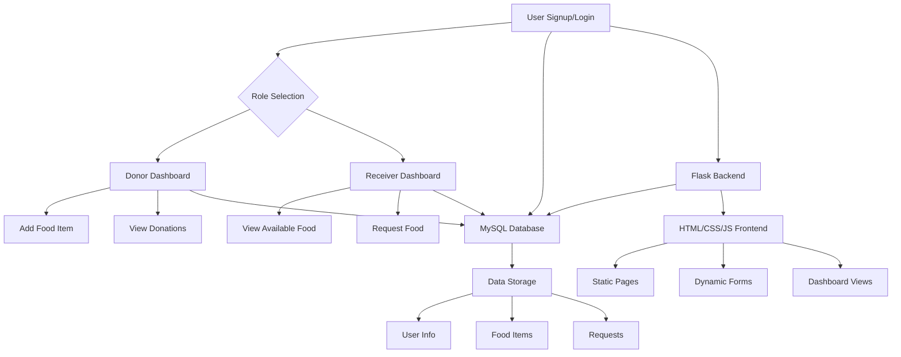

## Food Waste Management System

> A web platform to connect food donors and receivers, reduce food waste, and streamline donation logistics.

Web files:
- `index.html` - landing page with links
- `signup.html` - signup form (choose role: donor/receiver)
- `login.html` - login form
- `donor.html` - donor dashboard to add food items (all fields stored as strings)
- `receiver.html` - receiver dashboard to list food items
- `styles.css`, `app.js`, `firebase-config.js` (fill with your Firebase config)

WASM sorter:
- `c/wasm_sort.c` — a C quicksort implementation intended to be compiled to WebAssembly.
- After building it with Emscripten you will get `wasm_sort.js` and `wasm_sort.wasm`. Include the glue before `app.js` on pages that use sorting:

```html
<script src="/wasm_sort.js"></script>
<script type="module" src="/app.js"></script>
```

Build WASM (emsdk/emscripten required):

```bash
# from project root
emcc c/wasm_sort.c -O2 -s WASM=1 -s EXPORTED_FUNCTIONS='["_sort_ints","_malloc","_free"]' -s EXPORTED_RUNTIME_METHODS='["HEAP32"]' -o wasm_sort.js
```

The frontend will detect the Emscripten `Module` runtime and use the WASM sorter if available; otherwise it falls back to JS sort.

Firebase setup:
1. Create a Firebase project at https://console.firebase.google.com/
2. Enable Email/Password sign-in under Authentication
3. Create a Firestore database (start in test mode while developing)
4. Copy your Firebase config into `firebase-config.js`

Run the web app:
You can open the HTML files directly in a browser, or serve the folder with a simple static server. Example using Python 3:

```bash
# from inside the project folder
python3 -m http.server 5173
# then open http://localhost:5173/index.html
```

C modules:
- `c/stack.c`, `c/queue.c`, `c/linked_list.c`, `c/sorting.c` each contain test `main` functions.

Compile C examples:

```bash
gcc c/stack.c -o c/stack && ./c/stack
gcc c/queue.c -o c/queue && ./c/queue
gcc c/linked_list.c -o c/linked_list && ./c/linked_list
gcc c/sorting.c -o c/sorting && ./c/sorting
---

## 🛠 Tech Stack

- **Frontend:** HTML, CSS, JavaScript
- **Backend:** Python (Flask)
- **Database:** MySQL
- **Other:** Static web pages, Flask session management

---

## 🗂 Project Structure

- `index.html` — Landing page
- `sign-up.html` — Signup form
- `donor_home.html` — Donor dashboard
- `receiver_home.html` — Receiver dashboard
- `app.py` — Flask backend
- `database.sql` — MySQL schema
- `style.css`, `dashboard.css` — Styling
- `script.js` — Frontend logic

---

## 🏗️ System Architecture



---

## 🚀 Getting Started

1. Clone the repo:
	```bash
	git clone https://github.com/archittmittal/Foodwaste-Management-System.git
	```
2. Set up MySQL and update credentials in `app.py`.
3. Run Flask server:
	```bash
	python app.py
	```
4. Open `index.html` in your browser or use a static server:
	```bash
	python3 -m http.server 5173
	# then open http://localhost:5173/index.html
	```

---


### 📦 Features

- **Role-based Access:** Separate dashboards for donors and receivers
- **Easy Signup/Login:** Quick registration and authentication
- **Add Food Donations:** Donors can add surplus food with expiry and quantity
- **View & Manage Donations:** Donors track their donation history
- **Request Food:** Receivers can request food based on need and location
- **Browse Available Donations:** Receivers see real-time available food
- **Session Security:** User sessions managed securely with Flask
- **Data Storage:** All user and food data stored in MySQL
- **Responsive UI:** Clean, modern interface for all devices

---

### 💡 Usage Examples

- **Donor:**
	- Login, add a new food donation (e.g., "Bread, 20 packets, expires tomorrow")
	- View your donation history and see which items are still available
- **Receiver:**
	- Login, browse available food donations in your area
	- Submit a request for "Rice, 5kg, needed at XYZ location"
- **Admin (optional):**
	- Monitor donation and request statistics (feature can be added)

---

---

## 📄 License

MIT License
```
